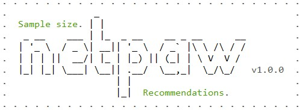

<h1 align="center">netpaw</h1>

<p align="center">
    
</p>

<p align="center">
    <a href="https://github.com/mihaiconstantin/netpaw/releases/latest">
        
    </a>	
    <a href="https://opensource.org/licenses/MIT">
        
    </a>
</p>

---

> Github repository name: **netpaw**

> Type: simulation package

---

## ⚠️ Notice:
The version on this branch is currently under heavy development and many things will change.

## Authors

- [Mihai A. Constantin](https://constantinmihai.com) | Tilburg University
- *add collaborators here...*

## Description

An `R` tool for performing power simulations for cross-sectional and times series network models. We recommend using the `devtools` `R` package for a straightforward installation and compilation.

## Important links

- this package is used in the following manuscripts:
    - *Power for Cross-Sectional Networks* available on [GitHub](https://github.com/mihaiconstantin/paper-power-cross-sectional-networks) and [OSF](https://osf.io/nz7tc)
    - *Power for Time Series Networks* available on [GitHub](https://github.com/mihaiconstantin) and [OSF](https://osf.io/eg5h8) 

## Example

The code block below illustrates the main functions in the package. Using them, one is able to replicate the simulations in the manuscripts or test how the procedure performs against a specific combination of factors (i.e., see the package documentation). Important information is also provided in the documentation associated with each function listed below.

### Exported functions

#### 1. build_design(participants, nodes, architectures, connectedness, models)
- builds the simulation design  

```r
# Specifying the factors.
participants    = seq(50, 1000, 50)
nodes           = c(10, 20, 30)
architectures   = c(random = 1, small_world = 2, scale_free = 3)
connectedness   = c(low = 1, medium = 2, large = 3)
models          = c(ising = 1, ggm = 2)

# Building the design.
design = build_design(participants, 
                      nodes, 
                      architectures, 
                      connectedness,
                      models)
             
head(design)
#   participants nodes architectures connectedness models
# 1           50    10             1             1      1
# 2           50    10             1             1      2
# 3           50    10             1             2      1
# 4           50    10             1             2      2
# 5           50    10             1             3      1
# 6           50    10             1             3      2
```


#### 2. run_cell(participants, nodes, density, architecture)
- applies the simulation procedure on a single design cell (i.e., referred to as row in the `design` matrix above)

```r
result_cell = run_cell(participants  = 300,
                       nodes         = 10, 
                       architecture  = 2,
                       connectedness = 3,
                       model         = 2)

result_cell
#  Simulation cell results:  
#       - - - - - - - - - - - - - - - - - - - - - - - - - - - - - - - - - - - - - - - - - - - - - - - - - - 
#    -> config: 300 participants | 10 nodes | small world architecture | 3 connectedness | ggm model. 
#       - - - - - - - - - - - - - - - - - - - - - - - - - - - - - - - - - - - - - - - - - - - - - - - - - - 
#    -> sensitivity: 0.85 
#    -> specificity: 0.88 
#    -> type one error: 0.12 
#    -> type two error: 0.15 
#    -> edge correlation: 0.9335286 
#    -> equal # nodes: yes 
# Try plot(result) for a visual inspection.

plot(result_cell)
```


- the output contains a list containing two sub-lists: `$raw`, `$computed`:
    - `$raw` contains the true and estimated model parameters and the data
    - `$computed` contains the outcome measures of interests


#### 3. run_cells(cells)
- applies the simulation procedure on a selected number of cells (i.e., it is a wrapper around `run_cell`)

```r
result_cells = run_cells(design[c(1, 97, 165), ])
# -> Running simulation for 3 cells:
#   -> config: 50 par | 10 nod | 1 arc | 1 con | 1 mod. Cell done. ✓
#   -> config: 100 par | 30 nod | 2 arc | 1 con | 1 mod. Cell done. ✓
#   -> config: 200 par | 10 nod | 1 arc | 2 con | 1 mod. Cell done. ✓
# -> Completed all 3 cells.
```


#### 4. replicate_cells(cells, replications)
- applies the simulation procedure on a selected number of cell and replicates the procedure `n` number of times (i.e., it is a wrapper around `run_cells`)

```r
replicated cells = replicate_cells(design[c(1, 97, 165), ], 2)
# Design replications requested: 2.

# ------------------------------
# Replication: 1.
# ------------------------------
# -> Running simulation for 3 cells:
#   -> config: 50 par | 10 nod | 1 arc | 1 con | 1 mod. Cell done. ✓
#   -> config: 100 par | 30 nod | 2 arc | 1 con | 1 mod. Cell done. ✓
#   -> config: 200 par | 10 nod | 1 arc | 2 con | 1 mod. Cell done. ✓
# -> Completed all 3 cells.

# ------------------------------
# Replication: 2.
# ------------------------------
# -> Running simulation for 3 cells:
#   -> config: 50 par | 10 nod | 1 arc | 1 con | 1 mod. Cell done. ✓
#   -> config: 100 par | 30 nod | 2 arc | 1 con | 1 mod. Cell done. ✓
#   -> config: 200 par | 10 nod | 1 arc | 2 con | 1 mod. Cell done. ✓
# -> Completed all 3 cells.

# Completed all 2 replications.
```

***Note:*** *Check the package documentation for each function for more details regarding the inputs and the outputs.*

## Installation

### Prerequisites

- see [section 1.3](https://cran.r-project.org/web/packages/Rcpp/vignettes/Rcpp-FAQ.pdf) from the `Rcpp` vignette

### Installation steps

- run `devtools::install_github("mihaiconstantin/netpaw")`

## Development

- feel free to email or send a PR request

## Road map:


1. Features:
    - ✔️ generate graphs
    - ✔️ generate parameters
    - ✔️ generate data
    - ✔️ estimate models
    - ✔️ compare generated & estimated models 
    - ✔️ expand combinations of simulation factors into a data frame
    - ✋ run and replicate combinations of design factors
    - ❌ connect and store the results to a MySQL database
    - ❌ post the results to an API endpoint using encrypted pre-generated tokens
2. Fixes:
    - ❌ merging and plotting the outcomes
3. Improvements:
    - ✔️ ~~update `README.md`~~

## License

The code in this repository is licensed under the [MIT license](https://opensource.org/licenses/MIT).
